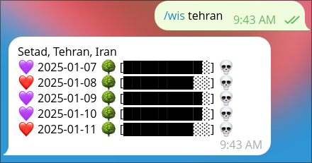

# WISON (Will I Suffocate or Not?)

W.I.S.O.N is a Telegram bot that provides you with AQI levels of any city, represented by hearts to uplift your mood despite the lack of oxygen!

You can try it out at https://t.me/wis_on_bot

The progress bar visually represents air pollution levels, with a fuller bar indicating higher pollution.

## Commands
`/wis {city_name}`: Get pollution levels of an specific city.

`/help`: Show help message.

